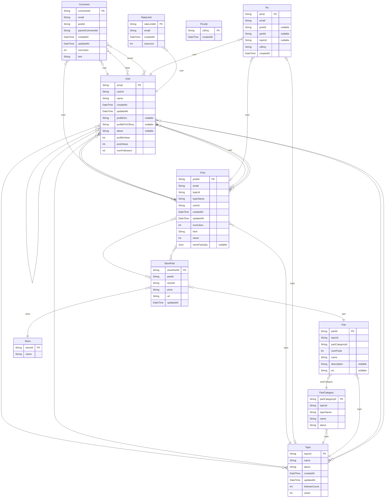
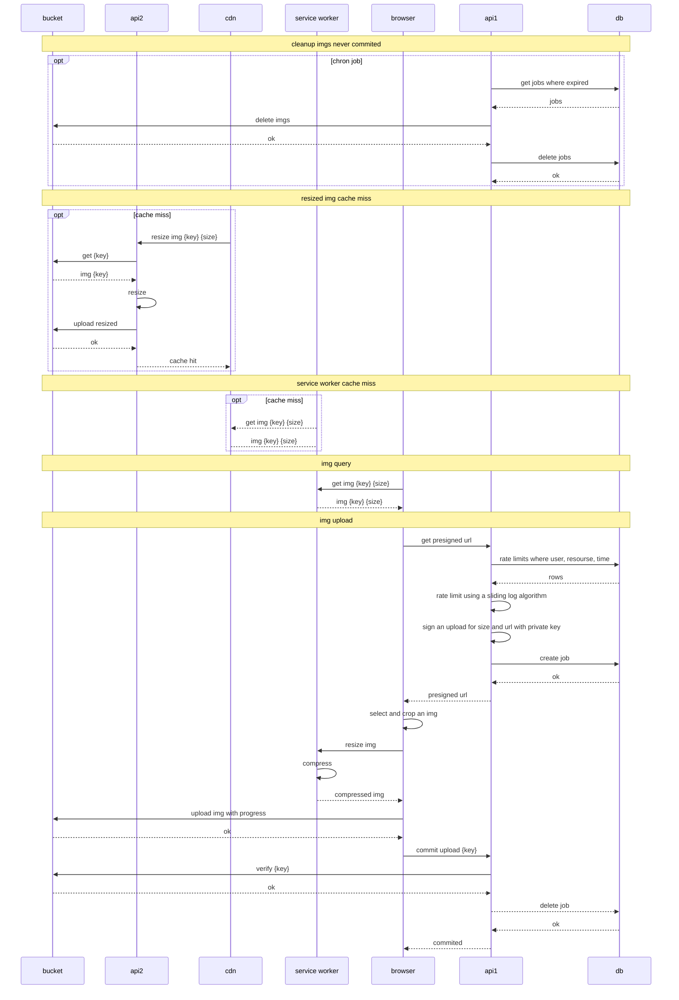
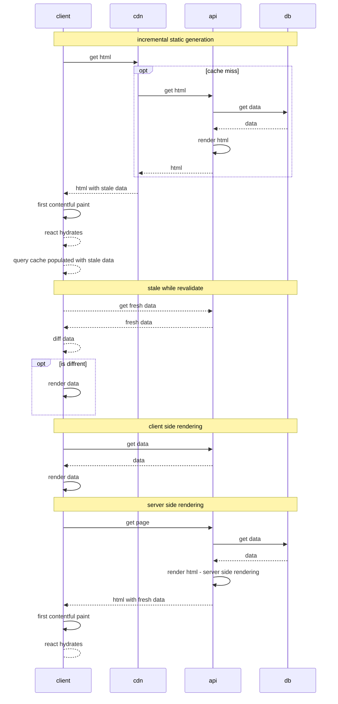

[![LinkedIn][linkedin-shield]][linkedin-url]

[linkedin-shield]: https://img.shields.io/badge/-LinkedIn-black.svg?logo=linkedin&colorB=555
[linkedin-url]: https://www.linkedin.com/in/teague-stockwell/

  
  <h3 align="center">More Builds</h3>
  

   A social media platform for exploring and sharing buidable items
     
    <a href="https://hello-next-auth.vercel.app">View Site</a>
    ·
    <a href="https://github.com/teaguestockwell/buildable-readme/issues">Report Bug</a>
  

  
<h2 style="display: inline-block">Table of Contents</h2>

    <li><a href="#about-the-project">About The Project</a></li>
    <li><a href="#system-architecture">System Architecture</a></li>
    <li><a href="#roadmap">Roadmap</a></li>
    <li><a href="#contact">Contact</a></li>
    <li><a href="#acknowledgements">Acknowledgements</a></li>

## About The Project
- share the build process of something that contains modular parts. for example a bike contains wheels, tires, a sprocket etc...
- users can explore other buids by filtering based on a specific parts
- more builds is a collection of topics that contain builds parts and their retialers.

## System Architecture

  

- gcp oauth
    - the browser perform an authentication flow, then it uses the api to [exchange an acsess code for an jwt cookie](https://sourcegraph.com/notebooks/Tm90ZWJvb2s6MTc2MQ==)
- vercel cdn
    - serve static acsess like html css and js to the browser
- vercel sererless functions
    - stateless deployment of a backend service that exposes crud, rate limiting, authorization, rbac and presigned upload urls (sas urls)
- aws cdn 1 + bucket 1
    - store and serve original imgs uploads
- aws cdn 2 + bucket 2
    - store and serve size variants of the origianl blobs
- aws functions
    - optimaize orignial imgs into many sizes with [sharp](https://aws.amazon.com/blogs/networking-and-content-delivery/image-optimization-using-amazon-cloudfront-and-aws-lambda/)
- planetscale mysql
    - a managed rdbs for horizontally scaling a cluster of mysql databases
- github next-api-mw
    - repo / feed for api middleware packakge [next-api-mw](https://www.npmjs.com/package/next-api-mw)
- github price-scraper
    - repo / feed for [getting product data such as price, name, images](https://www.npmjs.com/package/price-scraper)
- github more-builds
    - a repo for a monolithic app service with nextjs
- github scraper
   - a repo for a docker img built with express / nodejs / chromium for web scraping
- azure container registry
   - a artifact feed for docker images waiting to be applied to k8s
- azure k8s cert manager
   - rotates tls certs from lets encrpt
- azure k8s control plane
   - scraping service orchestration
- azure k8s ingress
   - https ingress and load balancer
- azure k8s nodes
   - nodejs scraper instances

### UI
- using nextjs and react most of the UI is served from a CDN as static html that gets updated with the latest data every so often
- when the browser loads the app, the client shows that stale html while the js fetches the latest data from the server in tha background.
- the ui used a mix of client and server side rendering to show contentfull content quickly
- in either case the client is hard at work combining the server's content with rich client side functionality.

### API
- deployed as serverless functions to vercel
- these functions use an orm called prisma to query a managed mysql cluster hosted on planetscale
- the api service is stateless and consumed using remote procedure call (RPC) and a [middleware i wrote for serverless functions](https://github.com/teaguestockwell/next-api-mw) that makes api functionality composable in a similar way to react hooks

### Scraping service
- allow users to add urls to parts they used in their post
- the bulk of the scraping service is built as an open source library [here](https://github.com/teaguestockwell/price-scraper). 
- it uses chromium to load a page then parses structured data embedded in the html similar to how [google indexes products for rich results](https://developers.google.com/search/docs/advanced/structured-data/intro-structured-data).
- [full writeup](https://teaguestockwell.com/blog/price-scraper)

### Serverless Connection Pooling
- serverless functions quickly exhaust db connections: a few of the solutions I have tried include:
  - aws rds and rds proxy
  - pgbouncer on an ec2 instance
  - digital ocean with postgres and pgbouncer.
- after working with these, I switched to planetscale to host a managed vitese cluster because it provides:
  - a free tier with up to 1000 connections
  - pull request based schema changes
  - excellent built in logs
  - multi AZ deployments
  - auto scaling to the moon because of vitess
  
### DB
- notably, when deploying to vitess, fk containtraints are not enforced
  - [this mean that fk indices need to be manually added](https://www.briananglin.me/posts/spending-5k-to-learn-how-database-indexes-work/)

### Image Uploads

### Incremental Static Regeneration & React Query

### Threaded comments
- [full writeup](https://teaguestockwell.com/blog/threaded-comments)
- statically cached html
- client side stale while revalidate
- optimistic updates

### Search
a simple database query with a client cache

## Roadmap
See the [open issues](https://github.com/teaguestockwell/buildable-readme/issues) for a list of proposed features (and known issues).

## Contact
Teague Stockwell - [LinkedIn](https://www.linkedin.com/in/teague-stockwell)

## Acknowledgements
- [TypeScript](https://www.typescriptlang.org)
- [React](https://reactjs.org/)
- [Nextjs](https://nextjs.org/docs/api-reference/create-next-app)
- [Prisma](https://www.prisma.io/)
- [Next Auth](https://next-auth.js.org/)
- [React Query](https://react-query.tanstack.com/)
- [Zustand](https://github.com/pmndrs/zustand)
- [Mantine](https://mantine.dev/)
